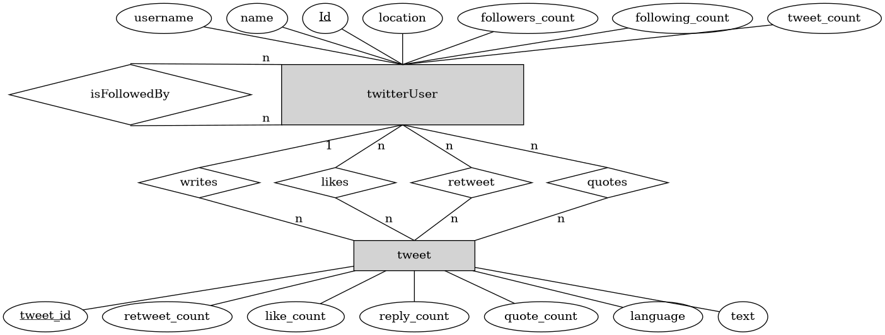

# Creating a Relational Database who will provide me a platform to study how Fake News spread throughout social media.

The social media used for my analysis is *Twitter*. This choise is based on the 
following facts:
+ Twitter is a platform with a broad audience. It has the impressive numbers of:
    1. *340 million users* (Last updated: 10/10/2020)
    2. *500 million tweets per day* (Last updated: 10/10/2020)
    
+ It allows anybody to study the information being produced at the platform. And,
By information I mean all the content produced, such as messages, pictures, video, audio or, 
more abstractly, graphs representing the connections between the users and their interactions. 

## The  Database
All data gathered will be stored at a *relational database* called
[SQLite](https://www.sqlite.org/index.html). 
In fact, I will use SQLite with *python3*. 
Thihs is done using the following 
library [sqlite3](https://docs.python.org/3/library/sqlite3.html).

### The metodology behind the collection of data
The info gathered will be based on daily searches
ranging from 7PM to 10PM (at the brazilian time) and will be based
on tweets whose content might have one of the following keywords (portuguese):
1. *Vaccine*;
2. *chloroquine*
3. *Covid* or *corona* or *Covid-19*;
4. *kit-covid* 
5. *early-treatment*
6. *azithromycin*
7. *lockdown*

### The Entity-Relationship model of my database
Down below there is the diagram of my ER model. 
(<i>obs: the diagram was made with the program *DOT*, from 
[GRAPHVIZ](https://graphviz.org/)</i>)

 

### The Relational Model.
Down bellow the <i>schemas</i> from our <b>relational model</b> 
are presented.

1.  The *USER* schema:
> USER(_Id_, name, username, location, followers_count,
> following_count, tweet_count)
2. The *TWEET* schema:
> TWEET(_tweet_id_, type, retweet_count, like_count, reply_count,
> quote_count, language, text, parent_tweet_id,
> author_tweet_id)
> - parent_tweet_id is a foreign key pointing to  TWEET;
> - author_tweet_id) is a foreign key pointing to USER

