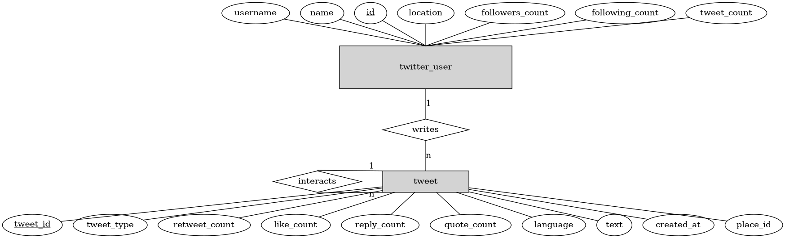
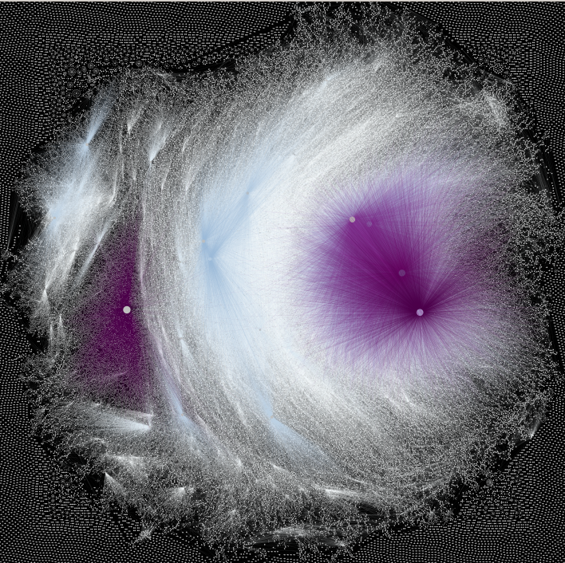
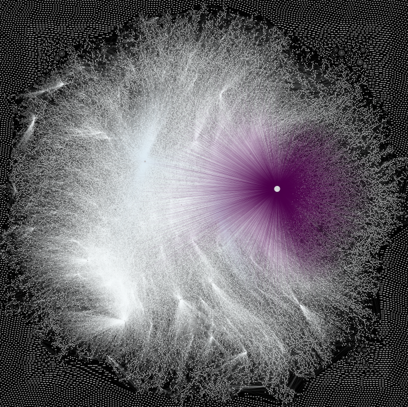
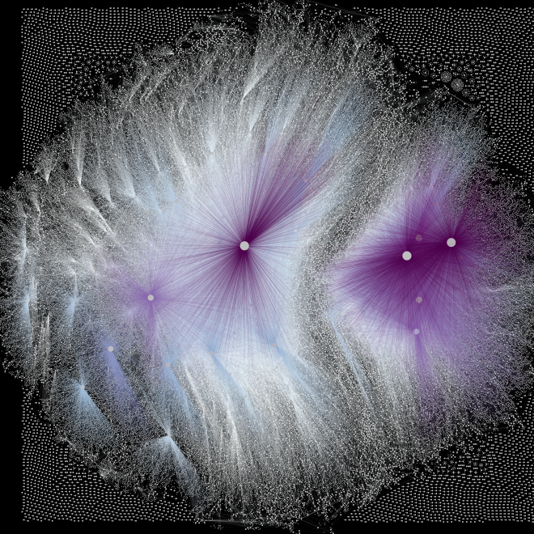
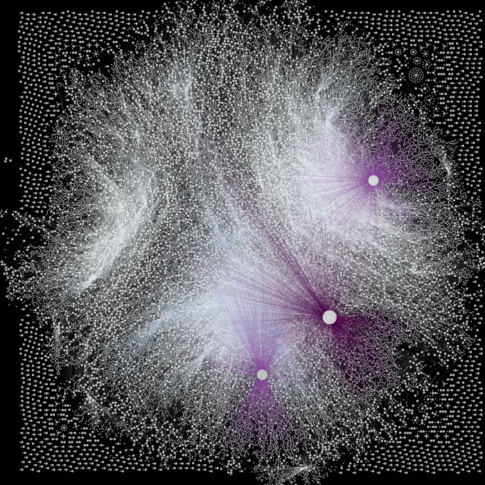
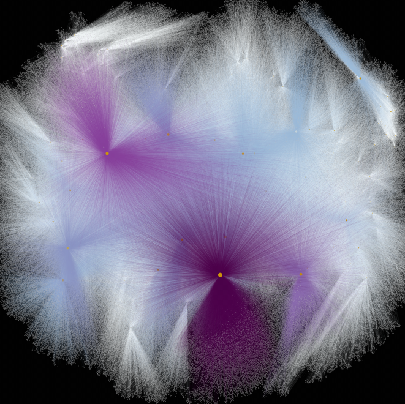

# Studying topological features of the users interaction Graph on Twitter

## A brief view of the work

Let G be the directed graph
$$
    G = (V, E),
$$
where <em>V</em> is the set of users that have written a tweet containing a word
in the set of keywords <strong>K</strong> and <em>E</em> the set
<div align='center'>
    E = (u, v), where  <em>u, v</em> ∈ V  and the user <em>v</em> 
    has interacted with <em>u</em>.
</div>
Here
<div align='center'>
    u → v ⇔ (u, v) ∈ E.
</div>
Also, each edge (u, v) ∈ E has a weight, given by the mean time that an user 
<em>v</em> interacts with <em>u</em>.


<strong>The objective</strong>  is to analyse the persistent homology of many graphs 
related with different keywords and to observe how fakenews influence their 
topological structure. These features can be used to classify graphs
between 'organic graphs' or 'graphs influenced by fakenews'.

## Programs to capture the users interaction Graph on Twitter

### The database
* Firstly, a [developer account on Twitter](https://developer.twitter.com/en)
is needed.

* Secondly, a <strong>Bearer Token</strong> is needed. It can be generated on the the section
  of authentication tokens at the developer portal.

Assume that you want to download tweets containing the keywords
* hello AND "hello world"
created between 12:00 (UTC 0) and 12:20(UTC 0) of the day 
2021-01-15. Below are the steps necessary to create the respective database.

Head to the folder <strong>database</strong> and edit the files 
<strong>keywordsList.txt</strong> and <strong>time.txt</strong> with the
desired parameters. These files have explanation
on how to change them. Then a few commands are necessary to be issued.

Follow the command lines below and a file named <strong>twitter.db</strong>
will be created
```
cd database
chmod +x searchTweets.sh
chmod +x insertTweetsAndUsersToDB.pl
chmod +x populateDB_part1.sh

./searchTweets
./populateDB_part1
```


The file <strong>twitter.db</strong> is a Relational Database satisfying
the Entity-Relation diagram below.

<div align='center'>
    
</div>

There are more relations on the database but their utility is only for future
computations. The raw data collected from the scripts above are in the relations
of the diagram above.

The atributes of the relational database are quite straightforward. The only 
atribute that is worth mentioning is <em>tweet_type</em>. This atribute
has as possible values:
* retweet: the tweet is a RT;                         
* reply: the tweet is a reply for another tweet;
* quote_plus_reply: the tweet is a quote plus a reply to another tweet;
* simple_message: the tweet is a simple message created by a user;
* quote_plus_simple_message: the tweet is a simple message whose content includes
  a quote to another tweet.

### Generating the users interaction Graph
Do the following 
```
# Given that you are still inside folder database
mv twitter.db ../graph_tools
cd ../graph_tools

chmod +x *.pl
chmod +x *.sh
./run_scripts.sh
```

Now the users interaction has been created inside <strong>twitter.db</strong>.
The relation taking care of this graph is called <em>paths_xy</em>. (There
is another relation called <em>nodes</em> that creates a forest where each
node is a tweet and each child is an interaction tweet with its parent.
This relation is not used by us anymore but I left on the database)

It is possible to vizualise the users interaction graph. To have an idea
on how it looks like do
```
# while still on the folder graph_tools
mv twitter.db ../plot_graph/
cd ../plot_graph

chmod +x print_plots.sh
./print_plots
```

At the end many plots will be made showing the most influente users and their
connections. To help make it easy to see some plots will ignore vertex that
are not that influent on the graph.

Down below some examples obtained by me.
<div align='center'>
    
    
    
    
    
    
</div>

## Calculating the persistent path homology

Copy the resulting <strong>twitter.db</strong> file obtained at the section 
before inside the folder <strong>calculate_pph_of_twitterDB/</strong>.
Do something like this
```
# Assume that we are inside the folder fakeNewsAnalysis/
# and twitter.db is inside graph_tools/
#
# Also, lets assume that twitter.db is related with topics on politcs.
# Whenever creating the folder down below follow the convention of copying
# twitter.db inside a folder named graph_ALABEL

mkdir calculate_pph_of_twitterDB/graph_politcs
cp graph_tools/twitter.db calculate_pph_of_twitterDB/graph_politcs
```

After doing this, create a file inside 
<strong>calculate_pph_of_twitterDB/graph_ALABEL</strong>
(in our example is <strong>calculate_pph_of_twitterDB/graph_politcs</strong>)
named as dates.txt. Such files must contain two dates that are important
for the analysis.
For example
```
$ cd calculate_pph_of_twitterDB/graph_tools
$ cat dates.txt
2022-01-01
2022-01-02
```

Now there are two variables inside <strong>calculate_pph_from_samples.sh</strong>
that must be set. They are
```
sampleSize='20'
amountOfSamples=100
```
where
* <strong>sampleSize</strong> is the size in percentage of the sample to be 
  taken from twitter.db to calculate the persistent homology. This is necessary
  given the size of the graphs (something around millions of edges in some cases)
* <strong>amountOfSamples</strong> is the number of how many times we will
  take a sample from the users interaction graph and calculate its 
  persistent path homology.

Once everything is set we can issue the command
```
chmod +x calculate_pph_from_samples.sh
./calculate_pph_from_samples
```
or, depending on how many cpus you have (lets assume 4),
you can run alternatively the following
```
chmod +x calculate_pph_from_samples.sh
./calculate_pph_from_samples 0 &
./calculate_pph_from_samples 1 &
./calculate_pph_from_samples 2 & 
./calculate_pph_from_samples 3 &
```

In the end, inside the folder 
<strong>~/fakeNewsAnalysis/calculate_pph_of_twitterDB/graph_ALABEL</strong>
we will have many folders named as sample0, sample1, ... containing
all persistent path homology in the files 
<strong>pph0.txt, pph1.txt</strong>

